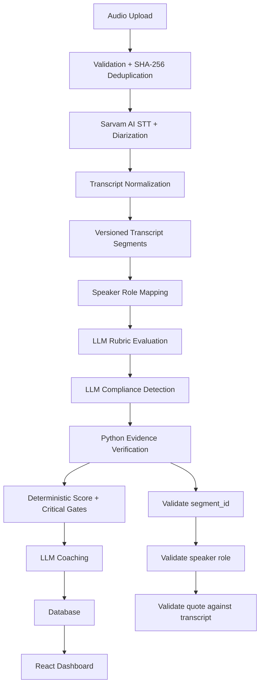

PW Counselling QA Platform
AI-powered quality assurance and compliance review for student counselling calls

An evidence-grounded QA platform that turns counselling-call recordings into structured, auditable quality reviews.
The system accepts Hindi, Hinglish, and English counselling calls, transcribes and diarizes them, evaluates the conversation against an editable QA rubric and compliance policy, verifies the evidence cited by the LLM against the underlying transcript, computes a deterministic score, and presents the result through a React dashboard.
Prototype status: Core pipeline and evaluation logic are validated locally. Production deployment is being hardened for serverless execution, particularly around asynchronous STT processing and durable audio storage.
Why this exists
Manual call QA does not scale well.
A QA reviewer typically has to:
1. Listen to a call.
2. Identify the relevant counselling moments.
3. Check the conversation against QA criteria.
4. Look for compliance violations.
5. Record evidence.
6. Calculate or verify the score.
7. Write coaching feedback.
This platform automates the repetitive parts while keeping the final evidence traceable to the original conversation.
Product goal
One call → one inspectable QA result.

The important design principle is not simply "use an LLM to score a call." The system separates LLM interpretation from programmatic evidence verification and deterministic scoring so that unsupported model claims do not silently become QA decisions.
Core workflow
Audio Upload
     │
     ▼
Pre-flight Validation
     │
     ├── File/type/size/duration checks
     └── SHA-256 duplicate detection
     │
     ▼
Sarvam AI Speech-to-Text
     │
     └── Batch transcription + speaker diarization
     │
     ▼
Transcript Normalization
     │
     └── Versioned, timestamped segments
     │
     ▼
Speaker Role Mapping
     │
     ├── Counsellor
     └── Student
     │
     ▼
LLM Evaluation
     │
     ├── Rubric scoring
     ├── Compliance detection
     └── Evidence citations
     │
     ▼
Python Evidence Verification
     │
     ├── Does segment_id exist?
     ├── Does speaker role match?
     └── Does quoted text exist in the segment?
     │
     ▼
Deterministic Scoring
     │
     ├── Weighted rubric score
     └── Critical compliance gates
     │
     ▼
LLM Coaching Generation
     │
     ▼
React QA Dashboard
Call state machine
uploaded
   │
   ▼
transcribing
   │
   ▼
analyzing
   │
   ├──────────────► completed
   │
   ├──────────────► needs_review
   │
   └──────────────► failed
Architecture

Components
Layer	Technology	Responsibility
Frontend	React + Vite	Uploads, call list, transcript, evaluation and QA dashboard
API	FastAPI	REST API, orchestration and persistence
STT	Sarvam AI saaras:v4	Speech recognition and speaker diarization
LLM	Gemini / Claude / OpenAI	Rubric interpretation, compliance detection and coaching
Verification	Python	Evidence validation and deterministic scoring
Local DB	SQLite	Zero-infrastructure local development
Production DB	PostgreSQL / Neon	Persistent production data
Audio storage	Local filesystem / durable production storage	Call recordings
Deployment	Vercel-compatible serverless deployment	Hosted frontend/API

Engineering decisions
1. Fixed pipeline instead of autonomous agents
This project intentionally does not use an autonomous multi-agent architecture.
QA and compliance workflows benefit from predictable execution and reproducibility.
The analysis path is bounded:
Rubric Evaluation
       ↓
Compliance Detection
       ↓
Evidence Verification
       ↓
Deterministic Scoring
       ↓
Coaching
Benefits:
- Reproducible evaluation steps.
- Bounded LLM usage.
- Easier debugging.
- Easier audit trails.
- Clear separation between model interpretation and programmatic decisions.
- Lower operational complexity than an agent loop.
The architecture can be extended later, but autonomous agents are not necessary for the current QA problem.
2. Why no vector database / RAG?
The current policy and rubric are small enough to fit directly into the model context.
Using retrieval would introduce additional moving parts:
- Embedding generation.
- Vector indexing.
- Retrieval thresholds.
- Chunking strategy.
- Re-indexing when policy changes.
- Potential retrieval misses.
For compliance evaluation, missing a policy rule because a semantic retrieval step failed can be worse than sending the bounded policy directly to the model.
Therefore the current prototype deliberately uses direct policy context instead of RAG.
A vector/RAG layer can be introduced later if the policy corpus grows substantially.
Evidence-grounded evaluation
A central feature of the platform is the evidence verification gate.
An LLM may produce a finding such as:
{
  "segment_id": "seg_42",
  "speaker": "counsellor",
  "quote": "..."
}
The application does not automatically trust that finding.
The Python verification layer checks:
1. Does segment_id exist?
2. Does the cited speaker match the transcript segment?
3. Does the quoted text exist in the cited segment after normalization?
4. Does the finding satisfy the rule's evidence requirements?
Unverified findings are separated from verified evidence and are not allowed to silently influence deterministic scoring or coaching.
Important limitation
Evidence verification proves textual support in the transcript.
It does not prove semantic intent.
For example, a counsellor discussing a refund policy may contain words associated with a compliance rule without actually violating the policy. Human review remains appropriate for consequential disciplinary decisions.
Scoring model
The LLM is responsible for interpreting the conversation against the rubric.
The application is responsible for the final deterministic score.
Conceptually:
LLM findings
     │
     ▼
Evidence verification
     │
     ▼
Verified criteria
     │
     ▼
Weighted rubric calculation
     │
     ├── Normal score
     │
     └── Critical compliance gate → score/pass status
Changing rubric weights should recompute the deterministic score without requiring another LLM call.
This makes the scoring layer easier to test, reproduce and audit.
Models and providers
Component	Current option	Purpose
Speech-to-Text	Sarvam AI saaras:v4	Indian-language transcription + diarization
LLM	Google Gemini gemini-2.5-flash	Evaluation / compliance / coaching
LLM	Anthropic Claude claude-3-5-sonnet-20241022	Alternative evaluation provider
LLM	OpenAI gpt-4o-mini	Alternative evaluation provider
Database	SQLite	Local development
Database	PostgreSQL / Neon	Production persistence

The LLM provider is configurable through environment variables rather than hard-coded into the UI.
Key features
Audio ingestion
- MP3/WAV upload.
- File validation.
- Maximum file-size and duration checks.
- SHA-256 duplicate detection.
- Existing-call detection for duplicate recordings.
Transcription
- Sarvam batch STT.
- Speaker diarization.
- Timestamped transcript segments.
- Transcript versioning.
- Re-transcription support.
QA evaluation
- Editable QA rubric.
- Rubric-based scoring.
- Compliance flag detection.
- Evidence citations.
- Critical compliance gates.
- Deterministic weighted scoring.
Evidence verification
- Segment existence validation.
- Speaker-role validation.
- Quote matching.
- Rejection of unsupported evidence.
- Manual-review path for uncertain findings.
Coaching
- Actionable coaching suggestions generated from verified findings.
- Feedback tied to the reviewed conversation rather than generic advice.
Dashboard
- Call list.
- Call inspector.
- Audio player.
- Transcript viewer.
- Speaker filtering.
- QA score.
- Compliance flags.
- Evidence.
- Coaching recommendations.
- Evaluation status.
Failure handling
The application includes defensive handling for common pipeline failures.
1. Upload validation
The frontend validates supported audio formats, configured file-size limits and audio-duration limits before uploading.
2. Duplicate detection
Audio is hashed with SHA-256. Duplicate recordings can be rejected instead of creating redundant calls.
3. STT failure handling
STT failures are persisted against the call rather than disappearing as an untracked request failure.
Where supported, transient provider/network failures can be retried with backoff.
4. Pipeline retry
Failed calls can be retried from the application UI/API.
5. Transcript versioning
Re-transcription creates a new transcript version.
Older evaluations are treated as stale rather than silently being associated with a different transcript.
6. API protection
When DEMO_ACCESS_TOKEN is configured, mutating API endpoints can require a bearer token or demo access header.
API surface
The backend exposes FastAPI endpoints for:
- Health checks.
- Call creation and upload.
- Call listing and retrieval.
- Audio retrieval.
- Transcript retrieval.
- Re-transcription.
- Pipeline retry.
- Evaluation.
- Rubric retrieval/update.
- Settings.
- Upload limits.
- Sarvam webhook processing.
Interactive API documentation is available from FastAPI at:
/api/docs
when the API is running with the /api deployment prefix.
Local development
Prerequisites
- Python 3.11+
- Node.js 18+
- npm
- ffmpeg
- Sarvam API key
- At least one supported LLM API key
1. Clone
git clone <repository-url>
cd PW-QA-Sales-Agent-01
2. Configure environment
Copy the example environment file:
cp .env.example .env
Configure the required provider credentials in .env.
Typical variables include:
SARVAM_API_KEY=...
GEMINI_API_KEY=...
ANTHROPIC_API_KEY=...
OPENAI_API_KEY=...

LLM_PROVIDER=gemini

# Optional:
DATABASE_URL=
DEMO_ACCESS_TOKEN=
Do not commit .env or API keys to GitHub.
For local development, leaving DATABASE_URL empty uses the local SQLite database.
3. Start the backend
cd backend
pip install -r requirements.txt
uvicorn app.main:app --host 127.0.0.1 --port 8000 --reload
Backend:
http://127.0.0.1:8000
API documentation:
http://127.0.0.1:8000/docs
Health endpoint:
http://127.0.0.1:8000/api/health
4. Start the frontend
In another terminal:
cd frontend
npm install
npm run dev
Then open:
http://localhost:5173
Database configuration
Local
The default local configuration uses SQLite.
backend/data/pw_qa.db
Production
Set:
DATABASE_URL=postgresql://...
The application then uses PostgreSQL instead of the local SQLite database.
For the hosted/serverless deployment, PostgreSQL provides persistence across application instances and invocations.
Production / serverless considerations
The application was initially designed around a local process where the filesystem and background workers are persistent.
Serverless deployment changes those assumptions.
Important constraints
- Serverless instances are ephemeral.
- Files outside supported temporary storage are not durable.
- Long-running STT jobs should not depend on a request remaining alive.
- Background tasks are not equivalent to a durable job queue.
- Audio required after the upload request must be stored durably.
- Async STT completion should be represented by persistent job state.
Production-hardened direction
Browser
  │
  ▼
FastAPI upload
  │
  ├── Persist call/audio metadata
  ├── Persist audio durably
  └── Create asynchronous STT job
          │
          ▼
       Sarvam
          │
          ▼
     Webhook callback
          │
          ▼
   Persist transcript
          │
          ▼
   Evaluation pipeline
          │
          ▼
      React polling
The prototype therefore distinguishes local synchronous development behavior from the requirements of a durable serverless production architecture.
Testing
The repository includes a test suite covering the main deterministic and API components.
The current documented suite contains 79 tests.
Run the non-evaluation suite with:
py -3.13 -m pytest -m "not eval"
Coverage areas include:
- API endpoints.
- Demo authentication.
- Upload limits.
- Transcript versioning.
- Stale evaluations.
- Scoring math.
- Critical compliance gates.
- Evidence verification.
- Quote normalization.
- Speaker-role heuristics.
- Transcript segmentation.
- Mocked STT behavior.
- Evaluation pipeline integration.
The tests use mocked external AI/STT calls where appropriate; therefore the test count should not be interpreted as 79 production calls.
Evaluation methodology
The prototype uses a small, self-labelled, role-played dataset.
It is intended as a prototype signal, not a production benchmark.
Useful evaluation metrics include:
Metric	Why it matters
Calls processed	Pipeline throughput
Human-vs-model score agreement	Scoring quality
Expected vs raised compliance flags	Detection quality
Evidence verification rejection rate	Grounding quality
Processing time per call	Operational latency
Tokens per call	Model efficiency
Cost per call	Unit economics
STT failure rate	Transcription reliability

No benchmark number is claimed here unless it has been measured from an actual run.
Known limitations
1. Speaker-role mapping is heuristic
Sarvam diarization produces speaker labels, but mapping those labels to "counsellor" and "student" currently uses application heuristics.
An interactive correction mechanism is therefore important for ambiguous conversations.
2. Hindi / Hinglish transcript representation
Speech recognition output may use different scripts for Hindi and English. The system preserves the underlying STT output rather than applying lossy transliteration.
3. SQLite concurrency
SQLite is appropriate for local development and low-concurrency usage.
Production workloads should use PostgreSQL.
4. Serverless audio persistence
A production deployment cannot rely on a normal application-local filesystem for durable audio storage.
Durable object storage or database-backed demo storage is required.
5. LLM/provider dependency
Gemini, Claude, OpenAI and Sarvam can fail because of:
- Invalid credentials.
- Rate limits.
- Quota exhaustion.
- Network failures.
- Provider-side outages.
- Model/API changes.
The application records failures so they can be surfaced instead of silently producing incomplete QA results.
6. Evidence verification is not semantic truth
The verifier can establish that an LLM-cited quotation exists in the transcript.
It cannot independently determine the speaker's intent or the complete legal/business context of a statement.
Human review remains necessary for high-stakes disciplinary or compliance decisions.
Security notes
Never commit:
.env
API keys
database credentials
access tokens
private customer recordings
The project is a prototype and should not be treated as a production compliance system without additional controls such as:
- User authentication.
- Role-based authorization.
- Audit logging.
- Encryption at rest and in transit.
- Secure object storage.
- Data-retention policies.
- Consent and recording policies.
- PII handling/redaction.
- Production secrets management.
- Provider-specific data-processing controls.
Project structure
.
├── backend/
│   ├── app/
│   │   ├── api/              # FastAPI routes
│   │   ├── config/           # Application settings
│   │   ├── db/               # Database engine/session
│   │   ├── models/           # ORM + API schemas
│   │   ├── pipeline/         # Evaluation, verification, scoring
│   │   └── services/         # STT/LLM integrations
│   ├── tests/                # Automated tests
│   └── requirements.txt
│
├── frontend/
│   ├── src/
│   │   ├── api/              # API client
│   │   ├── components/       # Dashboard components
│   │   └── ...
│   └── package.json
│
├── data/
│   └── policy/               # Demo policy/rubric data
│
├── scripts/                  # Utility/evaluation scripts
├── vercel.json               # Deployment configuration
├── .python-version
└── README.md
Product boundaries
This prototype is designed to demonstrate the QA workflow, not to claim that an LLM can autonomously make final compliance or employment decisions.
The intended operating model is:
AI finds and structures evidence
             +
Code verifies evidence and calculates score
             +
Human reviews consequential decisions
That separation is deliberate.
Roadmap
Near term
- Durable object storage for production audio.
- Durable asynchronous STT job handling.
- Production authentication and authorization.
- Better speaker-role assignment.
- Manager calibration workflow.
- More robust evaluation datasets.
- Provider observability and cost dashboards.
Later
- CRM integration.
- Team/manager dashboards.
- Longitudinal counsellor coaching.
- Consent-aware recording workflows.
- PII detection/redaction.
- Larger policy corpora with optional retrieval.
- Production job queues and worker infrastructure.
Demo data disclaimer
The prototype uses synthetic/demo policy content and role-played call data.
It should not be interpreted as using or representing confidential Physics Wallah customer data, internal policy, or production counselling records unless explicitly stated otherwise.
Author
Aditya Yadav
AI / Backend / Full-Stack Engineering
This project was built as a focused prototype demonstrating practical AI engineering, evidence-grounded evaluation, deterministic scoring, and production deployment considerations.
License
Add the appropriate project license before public distribution.
