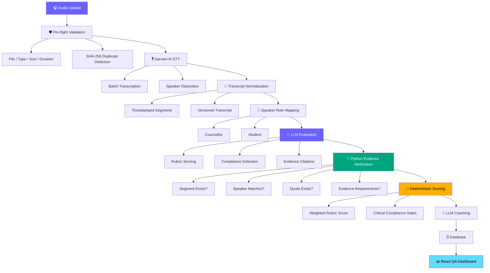
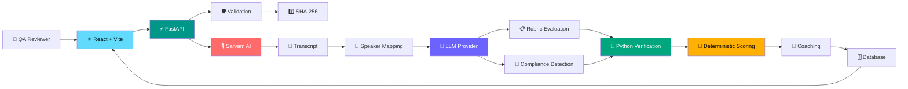
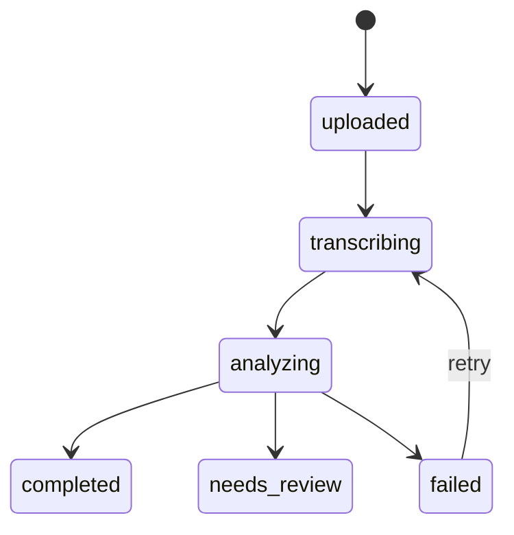
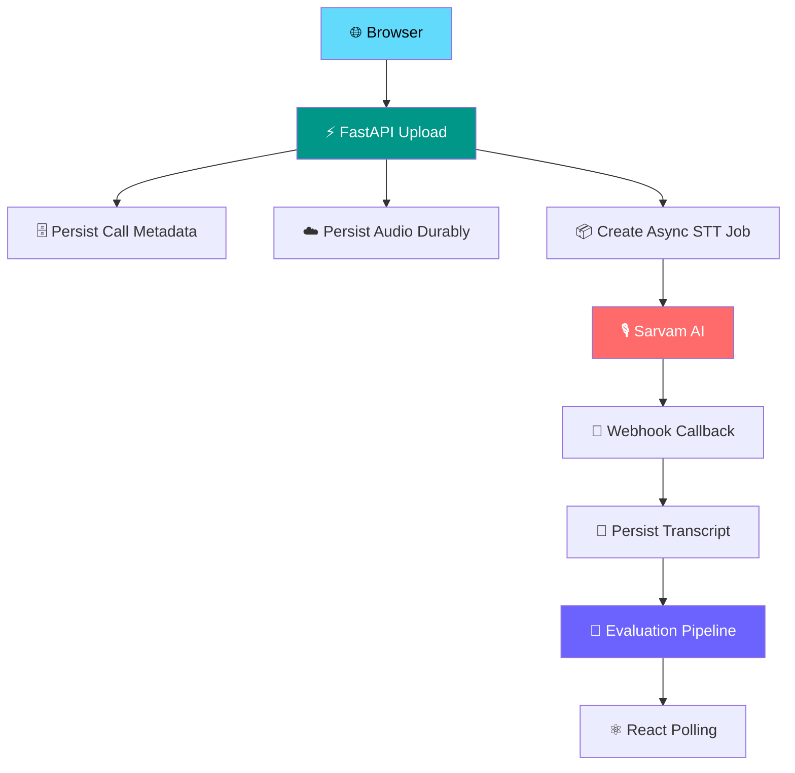

<div align="center">

# 🎧 PW Counselling QA Platform

### AI-Powered Call Quality Assurance & Compliance Intelligence

<p>
  <strong>Hindi • Hinglish • English</strong>
  &nbsp;·&nbsp;
  <strong>Evidence-Grounded AI</strong>
  &nbsp;·&nbsp;
  <strong>Deterministic Scoring</strong>
  &nbsp;·&nbsp;
  <strong>Human-in-the-Loop</strong>
</p>

<br/>

<a href="#-overview">
  
</a>
<a href="#-architecture">
  
</a>
<a href="#-testing">
  
</a>
<a href="#-tech-stack">
  
</a>
<a href="#-tech-stack">
  
</a>

<br/><br/>

> **One call → one inspectable QA result.**

<br/>


<br/>

</div>

---

## 🚀 Overview

**PW Counselling QA Platform** is an evidence-grounded AI system that transforms counselling-call recordings into structured, auditable quality reviews.

The platform:

- 🎙️ Accepts **Hindi, Hinglish, and English** counselling calls
- 📝 Transcribes calls with **speaker diarization**
- 🧠 Evaluates conversations against an **editable QA rubric**
- 🚨 Detects **compliance violations**
- 🔎 Verifies every AI-generated evidence citation against the original transcript
- 🧮 Calculates the final score **deterministically**
- 💬 Generates coaching feedback from **verified findings**
- 📊 Presents everything through a **React-based QA dashboard**

The core principle is simple:

> **Do not blindly trust an LLM to make the final QA decision.**

Instead:

```text
                 ┌──────────────────────┐
                 │       LLM            │
                 │ Interpretation       │
                 │ + Evidence Finding   │
                 └──────────┬───────────┘
                            │
                            ▼
                 ┌──────────────────────┐
                 │      Python          │
                 │ Evidence Verification│
                 └──────────┬───────────┘
                            │
                            ▼
                 ┌──────────────────────┐
                 │ Deterministic Score  │
                 │ + Compliance Gates   │
                 └──────────┬───────────┘
                            │
                            ▼
                 ┌──────────────────────┐
                 │ Human Review         │
                 │ for Consequential    │
                 │ Decisions            │
                 └──────────────────────┘
```

---

# 🎯 Why This Exists

Manual counselling-call QA does not scale.

A reviewer traditionally has to:

```text
🎧 Listen to the call
       ↓
🔍 Find relevant moments
       ↓
📋 Check QA criteria
       ↓
🚨 Identify compliance issues
       ↓
🧾 Record evidence
       ↓
🧮 Calculate the score
       ↓
💬 Write coaching feedback
```

This platform automates the repetitive parts while keeping the evidence traceable to the original conversation.

### Product Goal

<div align="center">

## **One Call → One Inspectable QA Result**

</div>

---

# ✨ Key Features

<table>
<tr>
<td width="50%" valign="top">

### 🎙️ Audio Ingestion

- MP3 / WAV support
- File validation
- File-size validation
- Duration validation
- SHA-256 duplicate detection
- Existing-call detection

</td>

<td width="50%" valign="top">

### 📝 Transcription

- Sarvam AI STT
- Speaker diarization
- Timestamped segments
- Transcript versioning
- Re-transcription support
- Hindi / Hinglish / English

</td>
</tr>

<tr>
<td width="50%" valign="top">

### 🧠 AI Evaluation

- Editable QA rubric
- Rubric-based scoring
- Compliance detection
- Evidence citations
- Critical compliance gates
- Coaching generation

</td>

<td width="50%" valign="top">

### 🔎 Evidence Verification

- Segment existence validation
- Speaker-role validation
- Quote matching
- Evidence normalization
- Unsupported-evidence rejection
- Manual-review path

</td>
</tr>

<tr>
<td width="50%" valign="top">

### 📊 QA Dashboard

- Call list
- Call inspector
- Audio player
- Transcript viewer
- Speaker filtering
- QA score
- Compliance flags

</td>

<td width="50%" valign="top">

### 🛡️ Failure Handling

- STT failure persistence
- Retry support
- Pipeline retry
- Transcript versioning
- Stale evaluation detection
- API access protection

</td>
</tr>
</table>

---

# 🧩 Core Workflow



---

# 🏗️ Architecture



---

# 🔐 The Most Important Design Decision

## Evidence-Grounded Evaluation

An LLM might produce:

```json
{
  "segment_id": "seg_42",
  "speaker": "counsellor",
  "quote": "..."
}
```

The application **does not automatically trust it**.

Instead, the Python verification layer checks:

```text
┌──────────────────────────────────────────┐
│         LLM Evidence Finding             │
└─────────────────────┬────────────────────┘
                      ↓
             Does segment_id exist?
                      ↓
               Does speaker match?
                      ↓
             Does quoted text exist?
                      ↓
          Does evidence satisfy rule?
                      ↓
              ┌───────┴───────┐
              │               │
           VERIFIED        REJECTED
              │               │
              ↓               ↓
        Score eligible     Manual review
```

### Verification checks

| Check | Purpose |
|---|---|
| `segment_id` exists | Prevent fabricated references |
| Speaker matches | Prevent incorrect attribution |
| Quote exists | Prevent hallucinated evidence |
| Evidence requirements | Ensure rule-specific support |
| Normalized matching | Handle transcript formatting differences |

Unsupported findings are separated from verified evidence and are **not silently allowed to influence deterministic scoring or coaching**.

---

# ⚖️ What the AI Does vs What Code Does

This separation is intentional.

| Responsibility | Owner |
|---|---|
| Understand conversation | 🧠 LLM |
| Interpret rubric | 🧠 LLM |
| Detect potential compliance issues | 🧠 LLM |
| Find supporting evidence | 🧠 LLM |
| Verify evidence exists | 🐍 Python |
| Validate speaker attribution | 🐍 Python |
| Validate quoted text | 🐍 Python |
| Calculate weighted score | 🐍 Python |
| Apply critical compliance gates | 🐍 Python |
| Generate coaching | 🧠 LLM |
| Consequential human decision | 👤 Human |

### The principle

<div align="center">

### 🧠 AI finds and structures evidence

### +

### 🐍 Code verifies evidence and calculates the score

### +

### 👤 Human reviews consequential decisions

</div>

---

# 📐 Scoring Model

The LLM interprets the conversation against the rubric.

The application calculates the final score.

```text
              LLM Findings
                   │
                   ▼
          Evidence Verification
                   │
                   ▼
            Verified Criteria
                   │
                   ▼
          Weighted Calculation
                   │
          ┌────────┴────────┐
          ▼                 ▼
    Normal Score      Critical Gate
          │                 │
          └────────┬────────┘
                   ▼
            Final QA Status
```

### Why deterministic scoring?

Changing rubric weights should recompute the score **without requiring another LLM call**.

That makes scoring:

- Reproducible
- Testable
- Auditable
- Easier to debug
- Less dependent on model variability

---

# 🔄 Call State Machine



---

# 🧠 Why a Fixed Pipeline Instead of Autonomous Agents?

This project intentionally **does not use an autonomous multi-agent architecture**.

QA and compliance workflows benefit from predictable execution and reproducibility.

The analysis path is deliberately bounded:

```text
┌─────────────────────┐
│ Rubric Evaluation   │
└──────────┬──────────┘
           ↓
┌─────────────────────┐
│ Compliance Detection│
└──────────┬──────────┘
           ↓
┌─────────────────────┐
│ Evidence Verification│
└──────────┬──────────┘
           ↓
┌─────────────────────┐
│ Deterministic Score │
└──────────┬──────────┘
           ↓
┌─────────────────────┐
│ Coaching Generation │
└─────────────────────┘
```

### Benefits

- ✅ Reproducible execution
- ✅ Bounded LLM usage
- ✅ Easier debugging
- ✅ Easier audit trails
- ✅ Clear separation of responsibilities
- ✅ Lower operational complexity
- ✅ Predictable failure handling

> Autonomous agents can be introduced later, but they are not necessary for the current QA problem.

---

# 🗂️ Why No Vector Database / RAG?

The current policy and rubric are small enough to fit directly into the model context.

Introducing retrieval would add:

```text
Embedding Generation
        ↓
Vector Indexing
        ↓
Chunking Strategy
        ↓
Retrieval Thresholds
        ↓
Policy Re-indexing
        ↓
Potential Retrieval Misses
```

For compliance evaluation, missing a policy rule because retrieval failed can be worse than sending the bounded policy directly to the model.

Therefore:

> **The current prototype deliberately uses direct policy context instead of RAG.**

A vector/RAG layer can be introduced when the policy corpus grows substantially.

---

# 🧱 Tech Stack

<div align="center">

| Layer | Technology |
|---|---|
| 🎨 Frontend | React + Vite |
| ⚡ API | FastAPI |
| 🎙️ Speech-to-Text | Sarvam AI `saaras:v4` |
| 🧠 Primary LLM | Google Gemini `gemini-2.5-flash` |
| 🤖 Alternative LLM | Anthropic Claude |
| 🤖 Alternative LLM | OpenAI |
| 🔎 Verification | Python |
| 🗄️ Local DB | SQLite |
| 🗄️ Production DB | PostgreSQL / Neon |
| 🎧 Audio Storage | Local filesystem / durable production storage |
| ☁️ Deployment | Vercel-compatible serverless deployment |

</div>

---

# 🤖 Model Providers

| Component | Current Option | Purpose |
|---|---|---|
| Speech-to-Text | Sarvam AI `saaras:v4` | Indian-language transcription + diarization |
| LLM | Gemini `gemini-2.5-flash` | Evaluation / compliance / coaching |
| LLM | Claude `claude-3-5-sonnet-20241022` | Alternative evaluation provider |
| LLM | OpenAI `gpt-4o-mini` | Alternative evaluation provider |
| Database | SQLite | Local development |
| Database | PostgreSQL / Neon | Production persistence |

The LLM provider is configurable through environment variables rather than being hard-coded into the UI.

---

# 🧪 Testing

The repository currently documents **79 tests** covering the primary deterministic and API components.

Run the non-evaluation suite:

```bash
py -3.13 -m pytest -m "not eval"
```

### Coverage includes

```text
✓ API endpoints
✓ Demo authentication
✓ Upload limits
✓ Transcript versioning
✓ Stale evaluations
✓ Scoring mathematics
✓ Critical compliance gates
✓ Evidence verification
✓ Quote normalization
✓ Speaker-role heuristics
✓ Transcript segmentation
✓ Mocked STT behavior
✓ Evaluation pipeline integration
```

> The tests use mocked external AI/STT calls where appropriate. The test count should therefore **not** be interpreted as 79 production AI/STT calls.

---

# 📊 Evaluation Methodology

The prototype uses a small, self-labelled, role-played dataset.

It is intended as a **prototype signal**, not a production benchmark.

Useful evaluation metrics include:

| Metric | Why it matters |
|---|---|
| Calls processed | Pipeline throughput |
| Human-vs-model score agreement | Scoring quality |
| Expected vs raised compliance flags | Detection quality |
| Evidence rejection rate | Grounding quality |
| Processing time per call | Operational latency |
| Tokens per call | Model efficiency |
| Cost per call | Unit economics |
| STT failure rate | Transcription reliability |

> No benchmark number is claimed unless it has been measured from an actual run.

---

# 🛡️ Failure Handling

The system is designed to surface failures instead of silently producing incomplete QA results.

### 1. Upload Validation

Validates:

- Supported audio formats
- File-size limits
- Duration limits

### 2. Duplicate Detection

Audio is hashed with:

```text
SHA-256
```

Duplicate recordings can be rejected rather than creating redundant calls.

### 3. STT Failure Handling

STT failures are persisted against the call instead of disappearing as untracked request failures.

Where supported, transient provider/network failures can be retried with backoff.

### 4. Pipeline Retry

Failed calls can be retried through the application UI/API.

### 5. Transcript Versioning

Re-transcription creates a new transcript version.

Older evaluations are treated as stale instead of silently being associated with a different transcript.

### 6. API Protection

When `DEMO_ACCESS_TOKEN` is configured, mutating API endpoints can require a bearer token or demo access header.

---

# 🔌 API Surface

The backend exposes FastAPI endpoints for:

```text
GET   Health checks
POST  Call creation / upload
GET   Call listing
GET   Call retrieval
GET   Audio retrieval
GET   Transcript retrieval
POST  Re-transcription
POST  Pipeline retry
POST  Evaluation
GET   Rubric retrieval
PUT   Rubric update
GET   Settings
GET   Upload limits
POST  Sarvam webhook processing
```

Interactive API documentation:

```text
/api/docs
```

When running locally:

```text
http://127.0.0.1:8000/docs
```

---

# 💻 Local Development

## Prerequisites

Make sure you have:

- Python `3.11+`
- Node.js `18+`
- npm
- ffmpeg
- Sarvam API key
- At least one supported LLM API key

---

## 1️⃣ Clone

```bash
git clone <repository-url>

cd PW-QA-Sales-Agent-01
```

---

## 2️⃣ Configure Environment

Copy the example environment file:

```bash
cp .env.example .env
```

Configure the required provider credentials:

```env
SARVAM_API_KEY=...

GEMINI_API_KEY=...

ANTHROPIC_API_KEY=...

OPENAI_API_KEY=...

LLM_PROVIDER=gemini
```

Optional:

```env
DATABASE_URL=
DEMO_ACCESS_TOKEN=
```

> ⚠️ **Never commit `.env` files or API keys to GitHub.**

If `DATABASE_URL` is empty, local development uses SQLite.

---

## 3️⃣ Start Backend

```bash
cd backend

pip install -r requirements.txt

uvicorn app.main:app \
  --host 127.0.0.1 \
  --port 8000 \
  --reload
```

Backend:

```text
http://127.0.0.1:8000
```

API documentation:

```text
http://127.0.0.1:8000/docs
```

Health endpoint:

```text
http://127.0.0.1:8000/api/health
```

---

## 4️⃣ Start Frontend

Open another terminal:

```bash
cd frontend

npm install

npm run dev
```

Then open:

```text
http://localhost:5173
```

---

# 🗄️ Database Configuration

## Local

The default local configuration uses SQLite:

```text
backend/data/pw_qa.db
```

## Production

Set:

```env
DATABASE_URL=postgresql://...
```

The application will then use PostgreSQL instead of the local SQLite database.

For hosted/serverless deployment, PostgreSQL provides persistence across application instances and invocations.

---

# ☁️ Production / Serverless Architecture

The original prototype assumes a local process where the filesystem and background workers are persistent.

Serverless deployment changes those assumptions.

### Important constraints

```text
⚠️ Serverless instances are ephemeral

⚠️ Local filesystem is not durable

⚠️ Long-running STT jobs cannot depend on a request remaining alive

⚠️ Background tasks are not equivalent to a durable job queue

⚠️ Uploaded audio must be stored durably

⚠️ Async STT completion needs persistent job state
```

### Production-Hardened Direction



The prototype therefore distinguishes **local synchronous development behavior** from the requirements of a durable serverless production architecture.

---

# ⚠️ Known Limitations

## 1. Speaker-role mapping is heuristic

Sarvam diarization produces speaker labels, but mapping those labels to:

```text
Counsellor
Student
```

currently uses application heuristics.

An interactive correction mechanism is therefore important for ambiguous conversations.

---

## 2. Hindi / Hinglish Representation

Speech recognition output may use different scripts for Hindi and English.

The system preserves the underlying STT output rather than applying lossy transliteration.

---

## 3. SQLite Concurrency

SQLite is appropriate for:

- Local development
- Low-concurrency usage

Production workloads should use PostgreSQL.

---

## 4. Serverless Audio Persistence

A production deployment cannot rely on a normal application-local filesystem for durable audio storage.

Durable object storage or database-backed demo storage is required.

---

## 5. LLM / Provider Dependency

Gemini, Claude, OpenAI, and Sarvam can fail because of:

```text
Invalid credentials
Rate limits
Quota exhaustion
Network failures
Provider outages
Model/API changes
```

The application records failures so they can be surfaced instead of silently producing incomplete QA results.

---

## 6. Evidence Verification ≠ Semantic Truth

This distinction matters.

The verifier can establish:

> “The LLM-cited quotation exists in the transcript.”

It cannot independently establish:

> “The speaker intended to violate the policy.”

For example, a counsellor discussing a refund policy might use words associated with a compliance rule without actually violating the rule.

Therefore:

> **Human review remains necessary for high-stakes disciplinary or compliance decisions.**

---

# 🔒 Security

Never commit:

```text
.env
API keys
Database credentials
Access tokens
Private customer recordings
```

The project is a prototype and should **not** be treated as a production compliance system without additional controls.

Production requirements include:

- 🔐 User authentication
- 👥 Role-based authorization
- 📜 Audit logging
- 🔒 Encryption at rest
- 🔒 Encryption in transit
- ☁️ Secure object storage
- 🗑️ Data-retention policies
- 🎙️ Consent and recording policies
- 🕵️ PII handling / redaction
- 🔑 Production secrets management
- 🧾 Provider-specific data-processing controls

---

# 📁 Project Structure

```text
PW-QA-Sales-Agent-01/
│
├── backend/
│   ├── app/
│   │   ├── api/
│   │   │   └──              # FastAPI routes
│   │   │
│   │   ├── config/
│   │   │   └──              # Application settings
│   │   │
│   │   ├── db/
│   │   │   └──              # Database engine/session
│   │   │
│   │   ├── models/
│   │   │   └──              # ORM + API schemas
│   │   │
│   │   ├── pipeline/
│   │   │   └──              # Evaluation / verification / scoring
│   │   │
│   │   └── services/
│   │       └──              # STT / LLM integrations
│   │
│   ├── tests/
│   │   └──                  # Automated tests
│   │
│   └── requirements.txt
│
├── frontend/
│   ├── src/
│   │   ├── api/
│   │   │   └──              # API client
│   │   │
│   │   ├── components/
│   │   │   └──              # Dashboard components
│   │   │
│   │   └── ...
│   │
│   └── package.json
│
├── data/
│   └── policy/
│       └──                  # Demo policy / rubric data
│
├── scripts/
│   └──                      # Utility / evaluation scripts
│
├── vercel.json
├── .python-version
└── README.md
```

---

# 🧭 Roadmap

## 🔥 Near Term

- [ ] Durable object storage for production audio
- [ ] Durable asynchronous STT job handling
- [ ] Production authentication & authorization
- [ ] Better speaker-role assignment
- [ ] Manager calibration workflow
- [ ] More robust evaluation datasets
- [ ] Provider observability
- [ ] Cost dashboards

## 🚀 Later

- [ ] CRM integration
- [ ] Team / manager dashboards
- [ ] Longitudinal counsellor coaching
- [ ] Consent-aware recording workflows
- [ ] PII detection / redaction
- [ ] Larger policy corpora with optional retrieval
- [ ] Production job queues
- [ ] Worker infrastructure

---

# 🎯 Product Boundaries

This prototype is designed to demonstrate the QA workflow.

It does **not** claim that an LLM can autonomously make final compliance or employment decisions.

The intended operating model is:

<div align="center">

```text
┌──────────────────────────────┐
│ 🧠 AI                       │
│ Finds + structures evidence │
└──────────────┬───────────────┘
               │
               ▼
┌──────────────────────────────┐
│ 🐍 Code                     │
│ Verifies + calculates score │
└──────────────┬───────────────┘
               │
               ▼
┌──────────────────────────────┐
│ 👤 Human                    │
│ Reviews consequences        │
└──────────────────────────────┘
```

### **That separation is deliberate.**

</div>

---

# 🧪 Demo Data Disclaimer

The prototype uses:

- Synthetic/demo policy content
- Role-played call data

It should **not** be interpreted as using or representing confidential Physics Wallah customer data, internal policy, or production counselling records unless explicitly stated otherwise.

---

# 👨‍💻 Author

<div align="center">

## Aditya Yadav

### AI / Backend / Full-Stack Engineering

Built as a focused prototype demonstrating:

**Practical AI Engineering**  
**Evidence-Grounded Evaluation**  
**Deterministic Scoring**  
**Production Deployment Considerations**

<br/>


</div>

---

# 📜 License

No public license is currently specified.

> Add the appropriate project license before public distribution.

---

<div align="center">

### ⭐ If you're reviewing this project, start here:

**Architecture → Evidence Verification → Deterministic Scoring → Production Considerations**

<br/>

`AI finds evidence.`  
`Code verifies evidence.`  
`Humans make consequential decisions.`

<br/>

**Built with intent, not just an LLM wrapper.**

</div>
