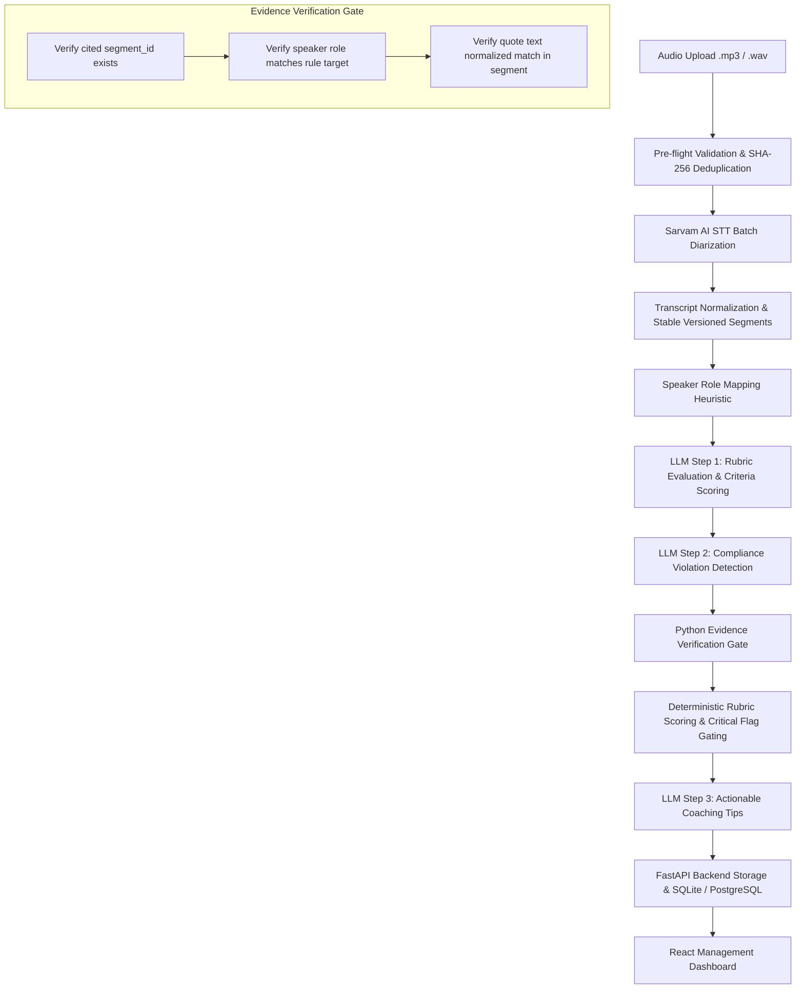

# AI Counselling Call QA & Compliance Platform

An automated quality assurance and compliance evaluation platform for student counselling calls across Hindi, Hinglish, and English. Designed for team leads and QA managers to systematically audit calls, verify compliance flags against ground-truth audio transcripts, and deliver evidence-grounded coaching.

---

## Architecture



### Pipeline State Machine
`uploaded` ➔ `transcribing` ➔ `analyzing` ➔ `completed` | `needs_review` | `failed`

---

## Design Decisions & Engineering Judgement

### 1. Why a Fixed Pipeline Instead of Autonomous Agents
* **Determinism & Reproducibility**: Quality assurance and regulatory compliance require consistent evaluation. A fixed three-step pipeline (`Rubric Scoring` ➔ `Compliance Detection` ➔ `Evidence-Grounded Coaching`) ensures identical prompt structure and auditable steps for every call.
* **Bounded Latency & Cost**: Autonomous agent loops risk tool oscillation, unpredictable context fan-out, and runaway token consumption. A fixed pipeline guarantees exactly 3 bounded LLM calls per analysis.
* **Auditability & Provenance**: Every run logs exact token counts, latency, provider parameters, and cost estimates to `llm_runs` and `stt_runs` tables.

### 2. Why No Vector DB / RAG
* **Bounded Context**: The complete counselling rubric and compliance policy occupy ~2,500–3,500 tokens. Modern frontier models (Gemini 2.5 Flash, Claude 3.5 Sonnet, GPT-4o-mini) comfortably fit the entire policy in prompt context.
* **Zero Chunking Artifacts**: Vector retrieval splits documents into semantic chunks, risking fragmented policy rules or missing negative conditions. In compliance auditing, missing a rule due to vector cosine distance is unacceptable.
* **Operational Simplicity**: Avoids maintaining external vector databases, embedding model drifts, and re-indexing pipelines.

### 3. Evidence Verification & Its Limitations
* **What It Verifies**: The verification layer (`app/pipeline/verify.py`) inspects every evidence quote cited by the LLM. It normalizes text (lowercasing, punctuation stripping, whitespace collapsing) and confirms exact or high-threshold fuzzy existence within the designated transcript segment for that specific speaker.
* **Hallucination Defense**: If an LLM cites a non-existent `segment_id`, cites student speech for a counsellor rule, or invents a quotation, the evidence is marked `verified: false`. Unverified flags are separated into "Needs Manual Check" and barred from factoring into deterministic scores or coaching prompts.
* **Honest Limitation**: Evidence verification proves **textual existence in the transcript**, not semantic violation intent. For instance, a counsellor clarifying a refund clause might trigger a keyword flag; human oversight remains essential for final disciplinary action.

---

## Models and APIs

| Component | Provider / Model | Rationale |
|---|---|---|
| **Speech-to-Text** | Sarvam AI (`saaras:v4` batch diarization) | Optimized for Indian linguistic nuances and multi-speaker separation. Supports Hindi (`hi-IN`), English (`en-IN`), and auto-detect. |
| **LLM Evaluation** | Google Gemini (`gemini-2.5-flash`), Anthropic Claude (`claude-3-5-sonnet-20241022`), or OpenAI (`gpt-4o-mini`) | Fast, structured JSON schema generation, high instruction-following adherence. Configurable via `LLM_PROVIDER` in `.env`. |
| **Database** | SQLite (default dev) / PostgreSQL (production) | SQLite requires zero infrastructure setup; `effective_database_url` resolves to an absolute path on boot. Swap to Postgres via `DATABASE_URL`. |

---

## Failure Handling Implemented

1. **Pre-flight Upload Validation**: Client-side validation in `UploadModal.jsx` verifies file extensions, file size against `MAX_UPLOAD_MB`, and audio duration against `MAX_AUDIO_MINUTES` before initiating network transmission.
2. **SHA-256 Deduplication**: Files are hashed on upload; duplicates return an HTTP 409 Conflict with a link to the existing call.
3. **STT Resilience & Error Recovery**: Network timeouts or rate limits from STT providers are caught with exponential backoff retries. If a call fails, the database records `status="failed"` along with the exact `failure_reason`.
4. **One-Click Retry**: Failed calls feature an immediate "Retry Call" button in the UI (`POST /calls/{id}/retry`) that safely re-queues processing.
5. **Transcript Versioning & Stale Evaluation Tracking**: When a call is re-transcribed under a different language mode, a new `TranscriptVersion` is created with unique segment IDs. Existing evaluations are flagged as `is_stale=True` with `stale_reason="based on an older transcript"` and a "Re-analyze Call" banner is shown.
6. **API Security via Demo Access Token**: When `DEMO_ACCESS_TOKEN` is configured, all mutating endpoints (`POST`, `PUT`, `DELETE`) require authorization (`Authorization: Bearer <token>` or `X-Demo-Access-Token: <token>`).

---

## Test Suite Summary

The repository includes a 79-test automated test suite (`py -3.13 -m pytest -m "not eval"`):

- **`backend/tests/test_api_endpoints.py`**: Validates `GET /rubric`, `PUT /settings`, `GET /calls/upload-limits`, `DEMO_ACCESS_TOKEN` protection on mutating routes, and CORS headers.
- **`backend/tests/test_transcription_versions.py`**: Verifies re-transcription creates new version IDs, invalidates old evaluations as stale, rejects cross-version quote verification, rejects invalid language modes, and preserves historical versions on STT failure.
- **`backend/tests/test_scoring.py`**: Tests weighted scoring math, critical gate failures (dropping score to 0 on major compliance breach), and dynamic rubric thresholds.
- **`backend/tests/test_verify.py`**: Tests quote normalization, fuzzy matching thresholds, and rejection of hallucinated segments or role mismatches.
- **`backend/tests/test_roles.py`**: Tests counsellor vs. student heuristic speaker classification.
- **`backend/tests/test_segments.py`**: Tests segment chunking, start/end timestamp ordering, and boundary validation.
- **`backend/tests/test_stt_adapter.py`**: Tests mocked Sarvam STT responses, timeout handling, and failure modes.
- **`backend/tests/test_evaluation_pipeline.py`**: Full pipeline integration test running rubric scoring, compliance checks, and coaching generation with mocks.

---

## Fresh Clone Setup Guide

### Prerequisites
* Python 3.11 or higher
* Node.js 18+ & npm
* `ffmpeg` installed on your system (required for audio duration probing)

### 1. Configure Environment
```bash
# Clone the repository
git clone <repo-url>
cd pw-counselling-qa

# Copy environment template
cp .env.example .env
```
Edit `.env` to provide your API keys (e.g., `GEMINI_API_KEY`, `SARVAM_API_KEY`). Leave `DATABASE_URL` empty to automatically use the absolute local SQLite database (`backend/data/pw_qa.db`).

### 2. Start the Backend
```bash
cd backend
pip install -r requirements.txt
uvicorn app.main:app --host 127.0.0.1 --port 8000 --reload
```
* Backend API docs: `http://127.0.0.1:8000/docs`
* Health check: `http://127.0.0.1:8000/health`

### 3. Start the Frontend
```bash
cd ../frontend
npm install
npm run dev
```
* Access UI at: `http://localhost:5173`
* Build production bundle: `npm run build` (SPAs served via `frontend/vercel.json` rewrites)

### 4. Running via Docker
```bash
# Build and run the backend container as non-root user with ffmpeg and healthcheck
docker build -t pw-qa-backend -f backend/Dockerfile backend/
docker run -p 8000:8000 --env-file .env pw-qa-backend
```

---

## Known Limitations

1. **Heuristic Role Assignment**: Diarization produces anonymized labels (`speaker_0`, `speaker_1`). Speaker roles are assigned via keyword matching (greeting patterns, course explanations). While an interactive role toggle is provided in the UI for corrections, subtle multi-speaker conversations can occasionally invert roles.
2. **Hinglish Output Script**: Sarvam batch diarization outputs Hindi speech in Devanagari script and English speech in Roman script. It does not provide native Roman transliteration for Hindi words. Stored transcripts preserve ground-truth acoustic output without lossy machine transliteration.
3. **Single-Node SQLite Concurrency**: The default SQLite database is single-writer. For high-volume concurrent deployments, configure `DATABASE_URL` with PostgreSQL.
4. **Local Audio Storage**: Audio files are stored under `backend/uploads/`. Production deployments should configure S3 or Google Cloud Storage.

---

<!-- RESULTS: to be filled from my real runs -->
## Evaluation & Benchmark Results
> **Note**: This section contains raw figures recorded from actual pipeline evaluation runs. No synthetic metrics or fabricated averages are included.

### Pipeline Telemetry & Cost
* **Sample Call Count**: [RESULTS: to be filled from my real runs]
* **Average Call Duration**: [RESULTS: to be filled from my real runs]
* **Average STT Latency**: [RESULTS: to be filled from my real runs]
* **Average LLM Pipeline Latency**: [RESULTS: to be filled from my real runs]
* **Average STT Cost per Call**: [RESULTS: to be filled from my real runs]
* **Average LLM Cost per Call**: [RESULTS: to be filled from my real runs]

### Metric Benchmarks
* **Scoring Spearman Correlation vs Human Gold Standard**: [RESULTS: to be filled from my real runs]
* **Mean Absolute Error (MAE) on Overall Score**: [RESULTS: to be filled from my real runs]
* **Compliance Flag Precision**: [RESULTS: to be filled from my real runs]
* **Compliance Flag Recall**: [RESULTS: to be filled from my real runs]
* **Evidence Citation Accuracy (Verified Support Rate)**: [RESULTS: to be filled from my real runs]
<!-- /RESULTS: to be filled from my real runs -->
